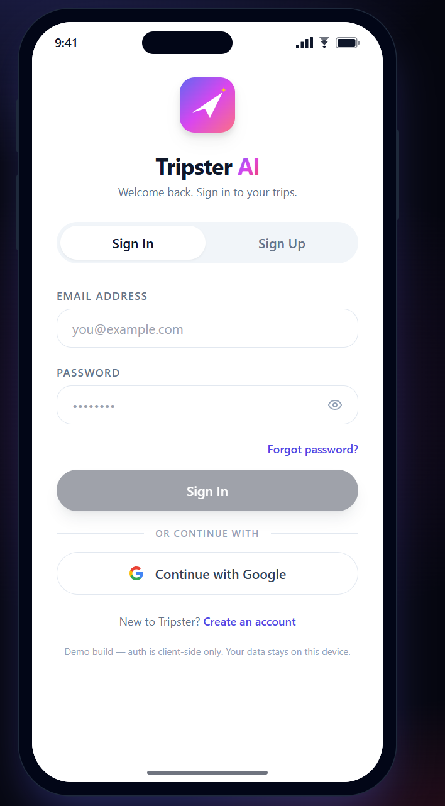
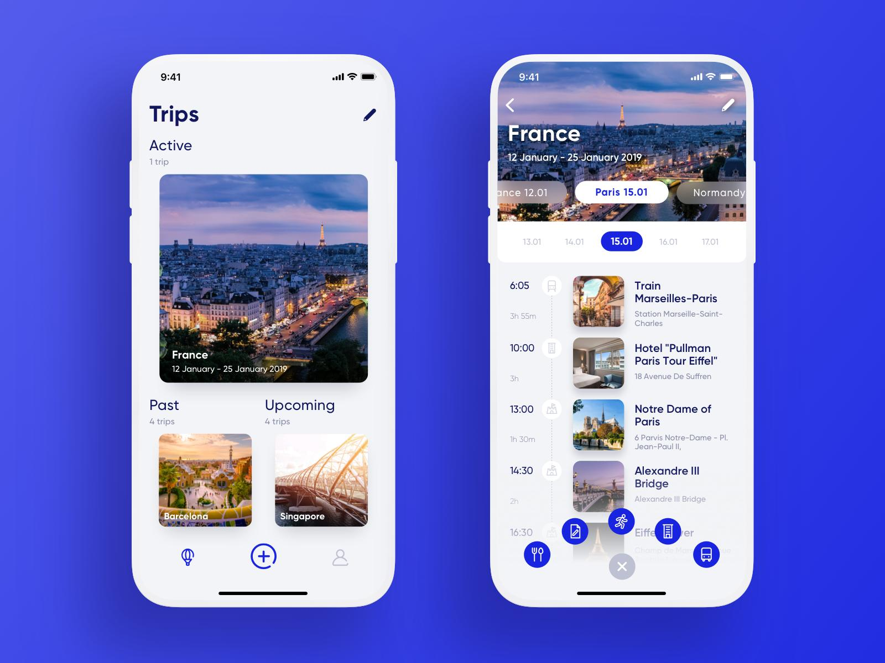
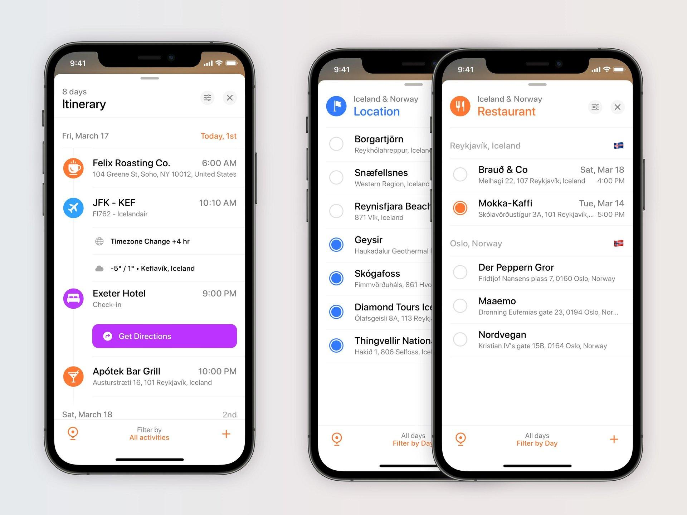

# Tripster AI

Tripster turns scattered booking confirmations into one organized, context-aware trip workspace. Add PDFs, screenshots, or confirmation text; review the extracted itinerary; catch scheduling problems; ask questions about the trip; and discover places that fit the plans already booked.

[Open the live demo](https://heytripster.vercel.app) | [View the repository](https://github.com/sparshcode/tripster)

> Tripster is currently a browser-local demo. Authentication is simulated, trip data stays in the current browser, and AI features use a bring-your-own Anthropic API key.

## Product flow

### 1. Sign in or create an account

The onboarding flow supports distinct sign-in and sign-up states plus a Google demo entry point, all presented inside a responsive iPhone frame.

<p align="center">
	
</p>

### 2. See every trip in one place

Trips are automatically grouped as active, upcoming, past, or still in planning. Open a trip to move from its overview into a date-filtered itinerary.



### 3. Build and refine the itinerary

Bookings become a chronological, day-by-day plan. Day chips show only dates with itinerary items, and selecting a date limits the timeline to that day. Tripster also surfaces tight transfers, overlaps, long gaps, and actions that need attention.

### 4. Discover places that fit the trip

Tripster uses the hotel as a location anchor and considers the complete itinerary before suggesting food, coffee, sights, or shops. It avoids places already booked and explains why each recommendation complements the current plans.



## What Tripster does

- **Multiple-trip home**: organize active, upcoming, planning, and past trips with destination photography.
- **Friendly trip creation**: enter a destination and attach multiple PDFs or images from a dedicated full-page flow.
- **AI booking extraction**: convert PDFs, screenshots, and pasted confirmation text into structured flights, hotels, activities, restaurants, and transport.
- **Trip overview**: see booking totals, alerts, the next event, booking categories, and hotel-aware discovery in one place.
- **Date-filtered itinerary**: inspect only the selected day or switch to all itinerary dates.
- **Conflict and gap detection**: flag overlapping bookings, tight same-day transitions, and long unscheduled windows without requiring AI.
- **Ask Tripster**: ask questions grounded in the booking context already added to the trip.
- **Itinerary-aware suggestions**: generate three place ideas that complement the hotel, timing, locations, and existing bookings.
- **Responsive phone experience**: use the app in an iPhone-style frame that fits desktop and mobile viewports.
- **Local-first persistence**: keep authentication state and trips in browser storage for the demo.

## How the AI features work

Tripster uses Anthropic Claude for three focused jobs:

1. **Extract bookings** through `/api/extract` and return structured booking fields.
2. **Answer trip questions** through `/api/ask` using only the supplied trip context.
3. **Suggest fitting places** through `/api/suggestions` using the hotel and full itinerary, with structured tool output.

The suggestions are planning ideas rather than live listings. Users should verify distance, business hours, availability, and current details before visiting.

## Privacy and API keys

Tripster follows a bring-your-own-key model:

- The Anthropic API key is requested only when an AI action is used.
- The key is kept in memory for the current browser tab.
- It is sent over HTTPS to Tripster's server route and then to Anthropic.
- It is not written to local storage by the app.
- Trip and demo-auth data remain in the current browser's local storage.

Do not use production credentials or sensitive travel documents with a demo deployment you do not control.

## Architecture

```mermaid
flowchart LR
		A[Next.js client] --> B[Browser local storage]
		A --> C[/api/extract]
		A --> D[/api/ask]
		A --> E[/api/suggestions]
		C --> F[Anthropic Claude]
		D --> F
		E --> F
```

## Technology

- Next.js 15 and React 18
- TypeScript
- Tailwind CSS
- Lucide icons
- Anthropic Messages API
- Browser local storage
- Vercel deployment

## Run locally

### Prerequisites

- Node.js 20 or newer
- npm
- An Anthropic API key for extraction, chat, and suggestions

### Setup

```bash
git clone https://github.com/sparshcode/tripster.git
cd tripster
npm install
npm run dev
```

Open [http://localhost:3000](http://localhost:3000). The app will request the Anthropic key in the browser when an AI feature is first used.

### Optional environment variable

No server-side API key is required. To select a different supported Anthropic model, create `.env.local`:

```bash
ANTHROPIC_MODEL=claude-sonnet-4-5
```

## Production build

```bash
npm run build
npm start
```

## Project structure

```text
app/
	api/                 AI extraction, chat, and suggestion routes
	page.tsx             Main client state and navigation
components/            Onboarding, trips, overview, itinerary, and controls
lib/                   Types, storage, formatting, photos, and conflict logic
docs/images/           README product-flow images
```

## Current limitations

- Authentication is a client-side product demo, not a production identity system.
- Trips do not sync between browsers or devices.
- AI suggestions do not query live maps, opening hours, distance, or availability data.
- Conflict checks use booking timestamps and do not yet include live travel-time estimates.
- Extracted booking details should be reviewed before relying on them.

## Roadmap

- Production authentication and account management
- Cloud trip persistence and cross-device sync
- Live maps, travel times, opening hours, and availability
- Add an accepted AI suggestion directly to the itinerary
- Pre-departure trip briefings and reminders
- Updated-booking comparison and change detection
- Collaborative trip sharing

## Deployment

The application is deployed on Vercel at [heytripster.vercel.app](https://heytripster.vercel.app). No environment variable is required for the default bring-your-own-key flow.
